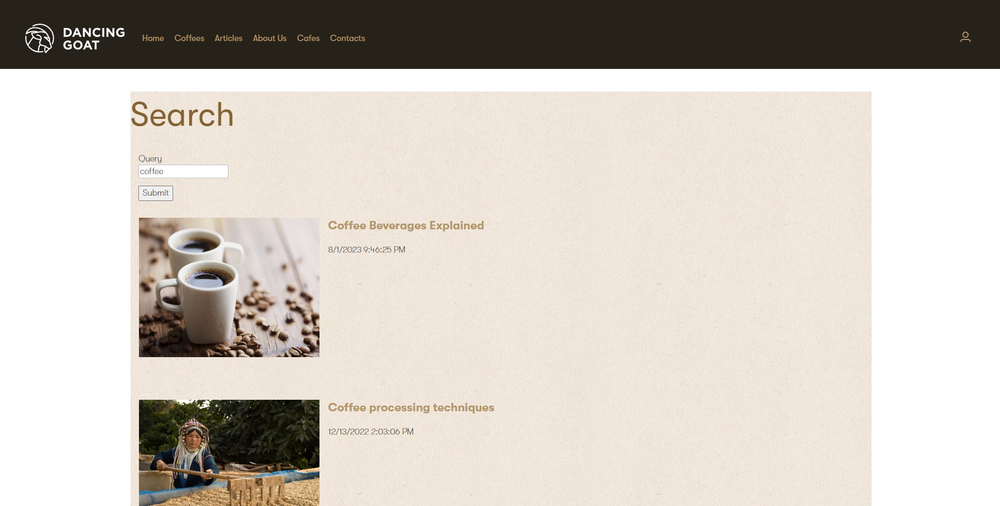

# Xperience by Kentico Lucene

[](https://github.com/Kentico/xperience-by-kentico-lucene/actions/workflows/ci.yml)

## About The Project

Helps with indexing and searching data with Lucene .NET.

> Current version is PRE RELEASE !!!



## Getting Started

### Prerequisites

- Xperience by Kentico >= 26.2.0

### Installation

Add the package to your application using the .NET CLI

```powershell
dotnet add package Kentico.Xperience.Lucene
```

### Add to your application dependencies

```csharp
builder.Services.AddKentico();
// ... other registrations
builder.Services.AddLucene(new[]
{
     // use your own index definition
     new LuceneIndex(
        typeof(KBankNewsSearchModel),
        new StandardAnalyzer(Lucene.Net.Util.LuceneVersion.LUCENE_48),
        KBankNewsSearchModel.IndexName,
        luceneIndexingStrategy: new KBankNewsLuceneIndexingStrategy()
     )
});
```

## Usage

- Review the "Search" functionality in the `src\Kentico.Xperience.Lucene.Sample` Dancing Goat project to see how to implement search.
- Read the Lucene.NET [introduction](https://lucenenet.apache.org/) or [full documentation](https://lucenenet.apache.org/docs/4.8.0-beta00016/) to explore the core library's APIs and functionality.
- Explore the [Lucene.NET source on GitHub](https://github.com/apache/lucenenet)

## Contributing

- .NET SDK >= 7.0.109

  - <https://dotnet.microsoft.com/en-us/download/dotnet/7.0>

- Node.js >= 18.12

  - <https://nodejs.org/en/download>
  - <https://github.com/coreybutler/nvm-windows>

For Contributing please see [`CONTRIBUTING.md`](https://github.com/Kentico/.github/blob/main/CONTRIBUTING.md) for more information and follow the [`CODE_OF_CONDUCT`](https://github.com/Kentico/.github/blob/main/CODE_OF_CONDUCT.md).

## License

Distributed under the MIT License. See [`LICENSE.md`](./LICENSE.md) for more information.

## Support

This contribution has **Full support by 7-day bug-fix policy**.

See [`SUPPORT.md`](https://github.com/Kentico/.github/blob/main/SUPPORT.md#full-support) for more information.

For any security issues see [`SECURITY.md`](https://github.com/Kentico/.github/blob/main/SECURITY.md).
